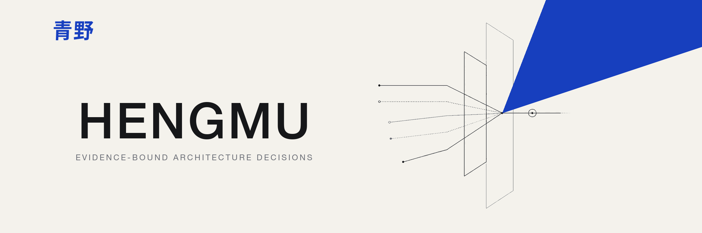

<p align="center">
  
</p>

<p align="center">
  <a href="https://qingye-lab.github.io/hengmu/">Website</a> ·
  <strong>English</strong> · <a href="README.zh-CN.md">简体中文</a>
</p>

<p align="center">
  <a href="https://github.com/qingye-lab/hengmu/actions/workflows/ci.yml">
    
  </a>
  <a href="https://github.com/qingye-lab/hengmu/releases">
    
  </a>
  
  <a href="LICENSE">
    
  </a>
</p>

<p align="center">
  <a href="#why-hengmu">Why Hengmu</a> ·
  <a href="#install-in-your-ide">Install</a> ·
  <a href="#quick-start">Quick start</a> ·
  <a href="#how-it-works">How it works</a> ·
  <a href="#workflows">Workflows</a> ·
  <a href="#trust-model">Trust model</a> ·
  <a href="#packages-and-ide-compatibility">Compatibility</a> ·
  <a href="#feedback-and-compatibility-reports">Feedback</a> ·
  <a href="#documentation">Documentation</a>
</p>

---

Hengmu is a local-first, evidence-bound architecture review and target-design
tool for Codex and compatible Agent Plugins. It turns repository facts,
approved design intent, and explicit constraints into evidence-bound
current-state assessments, open or constrained target architectures, traceable
decisions, executable plans, and deterministic policy results.

Current-state assessment and target design are equal entry paths. Existing
systems can move from candidate findings through independent verification to a
remediation decision. New systems and major redesigns can start from an approved
Design Brief and produce a complete target architecture without inventing a
Review or Findings. Required, preferred, and prohibited constraints are
challenged inputs, never proof of feasibility or fitness.

The architecture view includes performance efficiency, reliability, security
and privacy boundaries, data and API contracts, observability, testing,
deployment, technical debt, proportionality, technology selection, and
operating reality. Dedicated lenses cover AI-agent context and economics,
Memory, tool authority, privacy, behavior evidence, technology evolution,
mobile systems, and multi-project portfolios.

If you are looking for a repository-local architecture review, AI-agent
architecture audit, target architecture design, architecture decision
governance, remediation planning, or a deterministic quality gate, Hengmu is
built for that workflow. It is not a hosted architecture service or a generic
code linter.

It works at two levels:

- one repository, using a project-specific Profile, constraints, critical
  flows, rules, and review history;
- a portfolio of repositories, looking for duplication, stack sprawl, shared
  capability, ownership conflicts, data flows, and hidden coupling.

| Capability | What Hengmu does |
| --- | --- |
| Current-state assessment | Reviews boundaries and engineering qualities, then keeps findings candidate-only until independent verification resolves their evidence. |
| Target architecture design | Designs open or constrained targets across runtime and deployment units, data ownership, interfaces, trust boundaries, critical flows, operations, and technology choices. |
| Decisions and plans | Compares viable options, records why alternatives lose, and turns an authorized decision into ordered remediation or Greenfield implementation slices. |
| Evidence governance | Binds facts, Knowledge, provenance, authority, acceptance, and deterministic policy into one auditable chain. |

## Packages and IDE compatibility

Hengmu publishes two packages from the same source. The package choice changes
the discovery manifest and active host UI projection; it does not fork the
underlying Skills or local architecture runtime.

| Package | Manifest and contents | Intended host | What this repository verifies |
| --- | --- | --- | --- |
| Codex package | `.codex-plugin/plugin.json` plus Codex `agents/openai.yaml` metadata | Codex | Native manifest, Skill contracts, deterministic archive, and CI/release packaging |
| Agent Plugins package | Host-neutral root `plugin.json`, standard `skills/` and `resources/`, plus an inert Codex manifest retained for selector provenance | Cursor, VS Code/GitHub Copilot, and other Agent Plugins 1.0 clients | Standard manifest/layout projection, deterministic archive, and exclusion of Codex-only `agents/openai.yaml` files |

The portable package contains Agent Skills and does not include `mcp.json` or a
Cursor-specific `.cursor-plugin` extension. [Cursor's plugin documentation](https://cursor.com/docs/plugins.md)
states that spec-conformant Agent Plugins load without changes; this repository
has not yet recorded a Hengmu-specific installed smoke test in Cursor or another
external IDE. For that reason, format compatibility is not presented as a
guarantee of identical commands, permissions, UI, or marketplace behavior.

Use the [compatibility matrix](docs/compatibility.md) for the current evidence
boundary. Kiro currently consumes the same Skills through its Agent Skills
locations rather than the root Agent Plugins manifest. Host-specific Hooks,
permissions, rules, steering, and automatic lifecycle behavior are not installed
by either Hengmu package.

## Install in your IDE

Download the two ZIP files and their `.sha256` files from the same
[GitHub release](https://github.com/qingye-lab/hengmu/releases). Use
`hengmu-<version>.zip` for Codex and
`hengmu-<version>-agent-plugins.zip` for the other hosts below. Verify the
download before extracting it:

From the download directory, use `shasum` on macOS or `sha256sum` on Linux:

```bash
shasum -a 256 -c hengmu-<version>.zip.sha256
shasum -a 256 -c hengmu-<version>-agent-plugins.zip.sha256
```

Keep the extracted directory at a stable absolute path and call it
`HENGMU_ROOT`. Each host needs the complete directory, not only
`skills/hengmu`, because the router, focused Skills, schemas, Knowledge, and
deterministic CLI use relative paths across `skills/` and `resources/`.

### Codex and ChatGPT desktop

Extract the Codex ZIP into a personal plugin directory, for example
`~/.codex/plugins/hengmu`. Then add this entry to the `plugins` array in
`~/.agents/plugins/marketplace.json` (merge it with any existing marketplace
instead of replacing the file):

```json
{
  "name": "hengmu-local",
  "interface": { "displayName": "Hengmu Local" },
  "plugins": [
    {
      "name": "hengmu",
      "source": {
        "source": "local",
        "path": "./.codex/plugins/hengmu"
      },
      "policy": {
        "installation": "AVAILABLE",
        "authentication": "ON_INSTALL"
      },
      "category": "Developer Tools"
    }
  ]
}
```

Restart ChatGPT desktop, open **Plugins**, select **Hengmu Local**, and install
Hengmu. In Codex CLI, run `/plugins`, install Hengmu from the same marketplace,
and start a new session. Invoke the router with `$hengmu audit this repository`
or describe the outcome naturally. In ChatGPT Work mode, select it with
`@hengmu`. The Codex IDE extension can use standalone Skills but does not
currently provide the plugin browser; install the full Hengmu plugin through
ChatGPT desktop or Codex CLI. See the
[official OpenAI plugin installation documentation](https://developers.openai.com/codex/plugins/).

### Cursor

Extract the Agent Plugins ZIP into `~/.cursor/plugins/local/hengmu`, then
restart Cursor or run **Developer: Reload Window**. Open **Customize** and
confirm that the Hengmu Skills are enabled. You can also symlink a checked-out
Hengmu repository while developing:

```bash
mkdir -p ~/.cursor/plugins/local
ln -s /absolute/path/to/hengmu ~/.cursor/plugins/local/hengmu
```

Invoke `/hengmu audit this repository`, or ask for the same outcome in natural
language. Cursor loads the portable Skills, but this package does not install
Cursor-specific rules, agents, commands, Hooks, or variables. See
[Cursor's Agent Plugins installation guide](https://cursor.com/docs/plugins.md#installing-plugins).

### VS Code and GitHub Copilot

Enable `chat.plugins.enabled`, run **Chat: Install Plugin From Source**, and
enter `https://github.com/qingye-lab/hengmu`. For a pinned local build, extract
the Agent Plugins ZIP and register its absolute directory in VS Code settings:

```json
{
  "chat.pluginLocations": {
    "/absolute/path/to/hengmu": true
  }
}
```

Open **Chat: Open Customizations → Plugins** to confirm installation. VS Code
namespaces plugin-provided Skills with the plugin name, so invoke
`/hengmu:hengmu audit this repository` in Copilot Chat or use natural language.
The same package can be installed directly in GitHub Copilot CLI:

```bash
copilot plugin install qingye-lab/hengmu
copilot plugin list
copilot
```

Start a new Copilot CLI session after installation and invoke `/hengmu ...`.
See the official [VS Code Agent Plugins](https://code.visualstudio.com/docs/agent-customization/agent-plugins)
and [GitHub Copilot CLI plugin](https://docs.github.com/en/copilot/reference/copilot-cli-reference/cli-plugin-reference)
documentation.

### Kiro

Kiro discovers workspace Skills under `.kiro/skills/`; it does not use Hengmu's
root `plugin.json` for this installation path. Extract the Agent Plugins ZIP to
a stable `HENGMU_ROOT`, then project both the Skills and their shared resources
into the repository. Run these commands only when `.kiro/resources` is unused,
or merge the directories deliberately:

```bash
mkdir -p .kiro/skills .kiro/resources
cp -R "$HENGMU_ROOT/skills/." .kiro/skills/
cp -R "$HENGMU_ROOT/resources/." .kiro/resources/
```

Open **Agent Steering & Skills** in Kiro and confirm all nine Hengmu Skills are
visible. Invoke `/hengmu audit this repository` or use natural language. Do not
import only `skills/hengmu`: the router delegates to eight sibling Skills and
those Skills require the shared runtime. See the official
[Kiro Agent Skills guide](https://kiro.dev/docs/skills/).

### Prepare the shared Python runtime

Hengmu's Skills are portable, while its deterministic helpers require Python
3.11–3.14, PyYAML, and jsonschema. Install the locked dependencies into the
`python3` environment exposed to the IDE agent, or launch the IDE from this
activated environment:

```bash
cd "$HENGMU_ROOT"
python3 -m venv .venv
source .venv/bin/activate
python3 -m pip install --require-hashes -r requirements-runtime.lock
python3 resources/scripts/architecture_tool.py --version
```

The last command should print `architecture_tool.py 1.2.0`. On Windows
PowerShell, activate with `.venv\Scripts\Activate.ps1`. Installation does not
grant permissions or enable Hooks; review each host's agent permissions before
allowing repository writes or shell execution.

## Why Hengmu

Most code and architecture reviews stop too early: they produce observations.
Hengmu is designed around a longer, evidence-bound engineering decision chain.

| Typical review failure | Hengmu's response |
| --- | --- |
| A model sees a large file or a singleton and declares an architecture problem. | Candidate findings must survive independent verification and evidence resolution before they become trusted. |
| A team names a required stack but has no target architecture or explicit trade-offs. | Hengmu challenges required, preferred, and prohibited constraints, compares compliant variants, and records a complete target architecture instead of treating technology names as proof. |
| A missing capability is mentioned as criticism but never designed. | Confirmed gaps flow into solution comparison, remediation slices, rollback, tests, and acceptance criteria. |
| Every project copies the same architecture prompt and slowly diverges. | One global method reads a repository-local Profile and real constraints. |
| Each repository looks reasonable in isolation while the portfolio duplicates infrastructure. | Portfolio review models shared capabilities, dependencies, data flow, ownership, and coupling. |
| A prose policy says “must” but automation cannot prove it. | JSON Schemas, hashes, Git evidence, role policy, fingerprints, signatures, and stable exit codes make enforcement reproducible. |

<p align="center">
  
</p>

Hengmu is intentionally not a generic “best practices” checklist. A rule is
useful only when it protects a declared quality or critical flow, and a
recommendation is useful only when the project can understand its cost,
dependencies, migration order, and stopping conditions.

## Quick start

### 1. Prepare the runtime

Hengmu supports Python 3.11–3.14. The runtime is local: it requires no hosted
service, telemetry, credentials, network access, or MCP server.

```bash
git clone https://github.com/qingye-lab/hengmu.git
cd hengmu

python3 -m venv .venv
source .venv/bin/activate
python3 -m pip install --require-hashes -r requirements-runtime.lock
python3 scripts/validate_repository.py
```

On Windows PowerShell, activate the environment with:

```powershell
.venv\Scripts\Activate.ps1
```

### 2. Prepare the repository

```bash
HENGMU_ROOT=/path/to/hengmu

python3 "$HENGMU_ROOT/resources/scripts/architecture_tool.py" \
  prepare-project-audit --repo /path/to/your-project
```

The command creates a facts-derived repository-local control plane when it is
missing, or validates and reuses the existing one without overwriting it:

```text
.architecture/
├── profile.yaml
├── repository-facts.yaml
├── constraints.md
├── critical-flows.md
├── gate-policy.yaml
├── baseline.yaml
├── risk-acceptances.yaml
├── evidence-providers.yaml
├── evidence/
├── rules/
├── runs/
└── reviews/
```

### 3. Choose the outcome in Codex

The examples below use Codex's `$hengmu` invocation syntax. In another Agent
Plugins host, install the portable archive and invoke the same Skill through
that host's documented UI or command syntax; `$hengmu` is not a portable
invocation contract.

For an existing system, start with current-state assessment:

```text
Use $hengmu to audit this repository.
Treat missing capabilities as findings, but verify evidence before
recommending a structural change.
```

`$hengmu` is the only Skill name you need to remember. Invoke it by itself to
see the complete capability menu, or describe the outcome in natural language:

```text
$hengmu
$hengmu verify the latest candidate findings
$hengmu compare the queue and durable-workflow options
```

For a new system or major redesign, add and approve a Design Brief, then ask for
an open or constrained target:

```bash
if [ ! -e /path/to/your-project/.architecture/architecture-design-brief.yaml ]; then
  cp "$HENGMU_ROOT/resources/templates/architecture-design-brief.yaml" \
    /path/to/your-project/.architecture/architecture-design-brief.yaml
fi

python3 "$HENGMU_ROOT/resources/scripts/architecture_tool.py" \
  validate-design-brief \
  /path/to/your-project/.architecture/architecture-design-brief.yaml \
  --project /path/to/your-project
```

The copied template is deliberately `draft`. Before changing it to `approved`,
add `brief.approval` with an authorized decision-maker identity and at least one
repository-relative approval-evidence path and SHA-256, plus one detached SSH
signature per approver. The signatures must verify against the project's
`artifact_signatures` policy. Validation never treats the template authors or
a status string as approval.

```text
$hengmu design an open target architecture from the approved Design Brief
$hengmu constrain the target to FastAPI, PostgreSQL, and one production deployment; challenge each constraint and record rejected alternatives
```

The current Brief 1.1 path produces a proposed Decision 1.4 with the complete
target architecture. Hengmu does not approve the Brief or Decision and does not
implement application code. After an authorized decision maker accepts the
Decision, `$hengmu plan …` can produce a Greenfield Plan 1.3.

The audit path can be run directly: the Skill invokes the preparation command
and initializes `.architecture/` automatically. Use an explicitly read-only
request only when you want a one-off Advisory assessment with no repository
artifacts.

The project Profile decides which qualities and specialist reviews matter.
The global Skill provides the method; the repository provides the truth.

```yaml
project:
  name: example-service
  type:
    - ai-agent-platform
  critical_qualities:
    - traceability
    - recoverability
    - privacy
  required_reviews:
    - project-architecture
    - ai-agent-architecture
```

### 4. Validate the result

```bash
python3 "$HENGMU_ROOT/resources/scripts/architecture_tool.py" \
  validate-project /path/to/your-project

python3 "$HENGMU_ROOT/resources/scripts/architecture_tool.py" \
  gate --project /path/to/your-project --stage change

python3 "$HENGMU_ROOT/resources/scripts/architecture_tool.py" \
  gate --project /path/to/your-project \
  --decision .architecture/reviews/<greenfield-decision.yaml> --stage change
```

The gate returns `0` for pass, `1` for policy failure, and `2` for invalid
input or configuration.

## How it works

Hengmu separates model judgment from deterministic trust. It accepts two source
paths, and neither a candidate audit nor a constraint assertion is policy or
proof.

<p align="center">
  
</p>

The diagram is maintained as
[Mermaid source](diagrams/en/hengmu-governance-loop.mmd) and an
[editable Excalidraw scene](diagrams/en/hengmu-governance-loop.excalidraw).

1. **Establish facts and intent.** Inspect the repository and bind the Profile;
   for target design, add an approved Brief with measurable scenarios and
   boundaries.
2. **Load context.** Bind constraints, critical flows, selected Rule Packs, and
   task-scoped Knowledge without turning detected technology or owner assertions
   into proof.
3. **Assess or design.** Existing systems produce candidate findings for
   independent verification. Greenfield work uses the approved Brief to compare
   open or constraint-compliant targets without manufacturing Findings.
4. **Decide.** Record the selected target, rejected alternatives, trade-offs,
   complete architecture model, source bindings, and proposed status.
5. **Authorize.** A named decision maker accepts, rejects, or supersedes the
   Decision; Hengmu's router and Advisor cannot perform this transition.
6. **Plan.** Turn an accepted remediation or Greenfield target into ordered
   implementation slices, protections, rollback, stop conditions, and
   acceptance evidence.
7. **Gate.** Apply deterministic contract, finding, change, or release policy
   to provenance-bound artifacts.

## One method, many projects

A repository should not carry a private copy of the architecture method.
Instead, it carries only the context that makes its decisions different:

- `profile.yaml` — project type, critical qualities, and required reviews;
- `constraints.md` — real technical, product, regulatory, and team limits;
- `critical-flows.md` — business and runtime paths that must not regress;
- `architecture-design-brief.yaml` — target intent, quality scenarios,
  boundaries, and typed constraints;
- `reviews/` — candidate and verified Reviews, Decisions, Plans, and evidence
  history.

<p align="center">
  
</p>

Portfolio review adds the missing system-of-systems view: which capabilities
should be shared, which boundaries must remain independent, where data moves,
and where one repository can unexpectedly affect another.

## Workflows

The installable plugin exposes one stable entry point and eight focused
workflow Skills. Use `$hengmu` for normal work; direct focused invocation
remains available for automation and compatibility.

| What you type | Required input | Output |
| --- | --- | --- |
| `$hengmu` | Declared repository context, when present | Menu and read-only next-step guidance |
| `$hengmu audit/ai/mobile/portfolio …` | Repository or portfolio facts and Profile | Candidate Review in the selected scope |
| `$hengmu verify …` | Candidate Review and resolvable evidence | Provenance-bound verified Review |
| `$hengmu decide …` | Verified Review or approved Design Brief | Proposed Architecture Decision |
| `$hengmu design/specify/constrain …` | Approved Brief 1.1, facts, constraints, and selected Knowledge | Proposed Decision 1.4 with an open or constrained target architecture |
| `$hengmu plan …` | Accepted remediation or Greenfield Decision | Ordered remediation Plan 1.2 or Greenfield Plan 1.3 |
| `$hengmu gate …` | Schema-valid, provenance-bound artifacts | Deterministic policy result and stable exit code |

Commands are optional. Natural language such as
`$hengmu help me compare these two technical approaches` routes to the same
focused workflow.

### Focused workflow contracts

| Phase | Skill | Responsibility |
| --- | --- | --- |
| Audit | `project-architecture-audit` | Boundaries, data ownership, contracts, reliability, security, operations, tests, deployment, debt, and proportionality in one repository. |
| Audit | `ai-agent-architecture-audit` | Models, context necessity/assembly/compression/cache ordering, Memory, retrieval, tools, injection, privacy, approval, recovery, version-bound behavior evidence, cost, latency, and evolution boundaries. |
| Audit | `mobile-architecture-audit` | Local state, sync, migrations, background work, notifications, privacy, caching, and lifecycle behavior. |
| Audit | `portfolio-architecture-audit` | Duplication, stack sprawl, shared capabilities, dependencies, data flow, ownership, and hidden coupling across projects. |
| Verify | `architecture-finding-verifier` | Challenge candidates, resolve evidence, assign V0–V5 verification, and produce a provenance-bound trusted Review. |
| Decide | `architecture-solution-advisor` | Compare or specify open/constrained targets; assess required conflicts, preferred trade-offs, prohibited eliminations, and target units, flows, boundaries, operations, and Knowledge. |
| Plan | `architecture-remediation-planner` | Convert an accepted remediation or Greenfield target into ordered implementation slices, migration controls where applicable, protections, stop conditions, rollback, and acceptance criteria without inventing Findings. |
| Enforce | `architecture-quality-gate` | Apply deterministic contract, finding, change, and release policy to trusted artifacts. |

`$hengmu` may also explain the read-only lifecycle state and the next valid
focused workflow from existing artifacts. It does not verify findings, accept a
decision, mutate policy, or run a Gate on the user's behalf.

### Project-owned quality evidence

Hengmu treats language linters and quality analyzers as optional Evidence
Providers, not as architecture truth. The bundled catalog includes representative
providers for Python, JavaScript/TypeScript, Rust, Go, Swift, and Kotlin/JVM in
addition to architecture, contract, test, runtime, security, and supply-chain
providers.

Provider discovery distinguishes an applicable marker, project configuration,
enablement, executable availability, and readiness. A missing executable remains
an explicit unassessed evidence surface. Hengmu never downloads, installs, enables,
or adds a dependency implicitly. If installation would materially improve the
review, it first names the exact tool, scope, version strategy, command, affected
files, and consequence, then asks for user authorization.

A Provider pass proves only the captured command, executable, declared project
dependency closure, isolated cache mode, configuration,
commit, and output bytes. It becomes architecture evidence only after it is bound
to an applicable invariant and independently reviewed.

Knowledge curation is deliberately maintainer-only. Its source workflow lives
under `maintainer/skills/architecture-knowledge-curator/` and does not expand
the public end-user Skill surface.

## Trust model

Hengmu's trust boundary is simple:

> A model may propose. Evidence, authority, provenance, and policy decide what
> can become trusted or blocking.

A trusted Review binds the reviewed repository identity and Git state, exact
scope, Profile, repository facts, selected Knowledge, Rule Packs, candidate
review, verifier authority, semantic Finding fingerprints, critical-flow
coverage, and resolvable evidence.

The deterministic runtime provides:

- JSON Schemas for project, review, decision, plan, policy, baseline, risk
  acceptance, Knowledge, provider, benchmark, and governance artifacts;
- machine-readable core and domain Rule Packs with complete-coverage checks;
- sourced Knowledge Packs selected under explicit context budgets;
- opt-in Evidence Providers with no-shell execution, safe environment
  allowlists, timeouts, structured-output validation, and tamper-evident run
  records;
- Git evidence resolution, exact hashes, signature verification, SARIF, review
  diffing, artifact migration, benchmark scoring, and layered gates.

Gate stages are cumulative:

| Stage | Proves |
| --- | --- |
| `contract` | Schemas, provenance, identity, hashes, roles, and coverage are valid. |
| `finding` | Severity, confidence, verification, status, baseline, waiver, and risk acceptance satisfy policy. |
| `change` | Review freshness, changed contracts, required decisions, migration compatibility, signatures, and evidence resolution are acceptable. |
| `release` | Required evidence, decision authority, and complete remediation acceptance are present. |

Read the [assurance model](docs/assurance-model.md) for threats, controls, and
residual risk. A passing gate proves policy evaluation of supplied artifacts;
it does not prove that the audited product is correct, secure, compliant, or
well designed.

<details>
<summary>Trusted review and evidence commands</summary>

```bash
python3 resources/scripts/architecture_tool.py review-bindings \
  --project /path/to/project \
  --candidate .architecture/reviews/example-candidates.yaml

python3 resources/scripts/architecture_tool.py validate-review \
  /path/to/verified.yaml --project /path/to/project

python3 resources/scripts/architecture_tool.py verify-evidence \
  --repo /path/to/project --review /path/to/verified.yaml

python3 resources/scripts/architecture_tool.py verify-review-signature \
  --project /path/to/project --review /path/to/verified.yaml
```

</details>

<details>
<summary>Task-scoped Knowledge selection</summary>

```bash
python3 resources/scripts/architecture_tool.py inspect-repository \
  --repo /path/to/project \
  --output /path/to/project/.architecture/repository-facts.yaml

python3 resources/scripts/architecture_tool.py select-knowledge \
  --facts /path/to/project/.architecture/repository-facts.yaml \
  --profile /path/to/project/.architecture/profile.yaml \
  --task "Current architecture audit" \
  --skill project-architecture-audit \
  --output /path/to/project/.architecture/knowledge-selection.yaml \
  --context-output /path/to/project/.architecture/knowledge-context.yaml

python3 resources/scripts/architecture_tool.py validate-knowledge-context \
  /path/to/project/.architecture/knowledge-context.yaml \
  --selection /path/to/project/.architecture/knowledge-selection.yaml \
  --facts /path/to/project/.architecture/repository-facts.yaml \
  --profile /path/to/project/.architecture/profile.yaml
```

</details>

## Governance modes

Not every project needs the same ceremony.

| Mode | Use when | Behavior |
| --- | --- | --- |
| Advisory | The project needs structured architecture help without a blocking gate. | Skills produce evidence-backed artifacts; maintainers retain full judgment. |
| Governed | Important changes need trusted review, explicit decisions, and change policy. | Provenance, authority, freshness, and Finding policy are enforced. |
| Enforced | Releases require deterministic architecture evidence and completed remediation. | Change and release gates become required delivery controls. |

See [governance modes](docs/governance-modes.md) for adoption guidance.
`product_mode` is a declared operating tier, not a bypass: an explicitly
invoked gate always evaluates its policy.

## Documentation

| Read this | When you need |
| --- | --- |
| [Target architecture](docs/target-architecture.md) | Facts, Knowledge, workflow, trust boundaries, and runtime components. |
| [Assurance model](docs/assurance-model.md) | Threats, guarantees, non-guarantees, and residual risk. |
| [Governance modes](docs/governance-modes.md) | Advisory, Governed, and Enforced adoption. |
| [Evaluation guide](docs/evaluation.md) | Behavior benchmarks, ablation, scoring, and interpretation limits. |
| [Knowledge authoring](docs/knowledge-authoring.md) | Source quality, freshness, frontmatter, and curation rules. |
| [Compatibility](docs/compatibility.md) | Supported Python, schemas, artifacts, and version boundaries. |
| [Host compatibility](docs/host-compatibility.md) | Cross-IDE outcome equivalence, package paths, and host-specific boundaries. |
| [Support and feedback](SUPPORT.md) | Reproducible defects, documentation gaps, and host compatibility reports. |
| [1.0 migration](docs/migrating-to-1.0.md) | Open/constrained Brief/Decision/Plan artifacts, coexistence, and rollback. |
| [Release verification](docs/releasing.md) | Deterministic ZIPs, checksums, SBOMs, and attestations. |
| [Roadmap](docs/roadmap.md) | Canonical forward plan, evidence milestones, and conditional triggers. |
| [Implementation matrix](docs/comprehensive-review-implementation.md) | How review recommendations map to executable capability and evidence. |
| [Dogfood review history](.architecture/reviews/README.md) | How Hengmu governs its own repository. |
| [Visual assets](docs/assets/brand/README.md) | Bilingual icon, banner, editorial character, and diagram source conventions. |

Accepted architecture decisions live in [docs/decisions](docs/decisions/).
The repository's implemented target state is tracked in the
[target architecture implementation matrix](docs/target-architecture-implementation.md).

## Development

```bash
python3 -m venv .venv
source .venv/bin/activate
python3 -m pip install --require-hashes -r requirements-dev.lock

python3 scripts/validate_repository.py
python3 resources/scripts/architecture_tool.py validate-project .
python3 resources/scripts/architecture_tool.py validate-history-anchors .
python3 resources/scripts/validate_knowledge.py
python3 -m pytest
python3 resources/scripts/architecture_tool.py gate --project . --stage change
python3 -m ruff check .
python3 -m ruff format --check .
python3 scripts/audit_licenses.py
```

Build and verify both deterministic plugin archives:

```bash
python3 scripts/package_plugin.py --format codex --output-dir dist
python3 scripts/package_plugin.py --format agent-plugins --output-dir dist
python3 scripts/smoke_test_package.py \
  --format codex \
  --archive dist/hengmu-<version>.zip
python3 scripts/smoke_test_package.py \
  --format agent-plugins \
  --archive dist/hengmu-<version>-agent-plugins.zip
python3 scripts/verify_checksum.py dist/*.zip.sha256
python3 scripts/generate_sbom.py \
  --archive dist/*.zip \
  --output-dir dist
```

The Codex archive is `hengmu-<version>.zip`. The portable Agent Plugins
archive is `hengmu-<version>-agent-plugins.zip` and uses the host-neutral root
`plugin.json`. It also retains the complete `.codex-plugin/plugin.json`,
including its Codex-only `interface` fields, as inert provenance data required
by the shared Knowledge selector. Codex-specific `skills/*/agents/openai.yaml`
files are excluded from the portable archive.

CI runs the supported Python boundary on Linux, macOS, and Windows. Tagged
releases publish both deterministic ZIPs, their SHA-256 checksums and SPDX
SBOMs, and GitHub provenance/SBOM attestations.

## Feedback and compatibility reports

Real user feedback is welcome, including reports that a Skill works differently
across Codex, Cursor, or another Agent Plugins host. Open a
[bug report](https://github.com/qingye-lab/hengmu/issues/new?template=bug_report.yml)
for reproducible behavior or a
[feature request](https://github.com/qingye-lab/hengmu/issues/new?template=feature_request.yml)
for a focused improvement. Read [SUPPORT.md](SUPPORT.md) first.

For an IDE or host report, include the package format, Hengmu version or commit,
client name and version, operating system, installation path, Skill or prompt,
expected result, observed result, and sanitized logs. Do not include credentials,
private repository content, or personal data. We treat client support as
evidence-backed and time-bound: a report can improve the compatibility record,
but an untested client is not presented as verified support.

## Non-goals

Hengmu does not:

- autonomously approve architecture decisions, risk, or releases;
- turn every detected technology, pattern, or large file into a Finding;
- discover unrelated repositories without an explicit portfolio registry;
- implement the audited product's remediation by itself;
- replace dedicated security, privacy, performance, legal, or compliance
  assessment;
- prove that a system is secure or correct.

## Contributing

Focused issues and pull requests are welcome. Start with
[CONTRIBUTING.md](CONTRIBUTING.md), then read
[GOVERNANCE.md](GOVERNANCE.md), [SECURITY.md](SECURITY.md), and
[SUPPORT.md](SUPPORT.md).

Changes to public schemas, CLI behavior, policy, trust boundaries, or persisted
artifacts require compatibility analysis, tests, migration notes, and an
updated architecture decision when authority changes.

When a Review or Selector Runtime binds source commits, preserve those commits
with a Merge Commit. Squash or rebase merging can invalidate source ancestry
and is rejected by `validate-history-anchors`.

## Credits and license

Hengmu is a [青野](https://github.com/liyanqing90) open-source project:
**理性结构中的持续进化，在不确定中，持续构建。**

The README's editorial illustration system was created with
[Ian Xiaohei Illustrations](https://github.com/helloianneo/ian-xiaohei-illustrations)
and recast with an original 青野 builder character derived from the public
青野 avatar and brand palette. The technical flow is
available as Mermaid, Excalidraw, SVG, and PNG so documentation remains
editable.

PAAD-derived concepts retain attribution in [NOTICE](NOTICE) and
[third_party/PAAD-MIT.txt](third_party/PAAD-MIT.txt).

The software is licensed under the [MIT License](LICENSE). The 青野 wordmark
identifies the originating project and is not a grant to imply endorsement.
